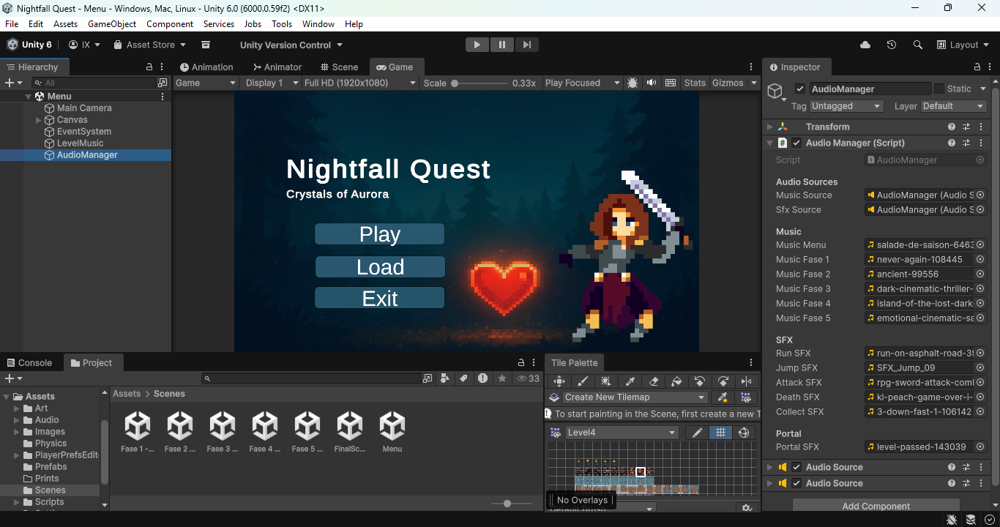
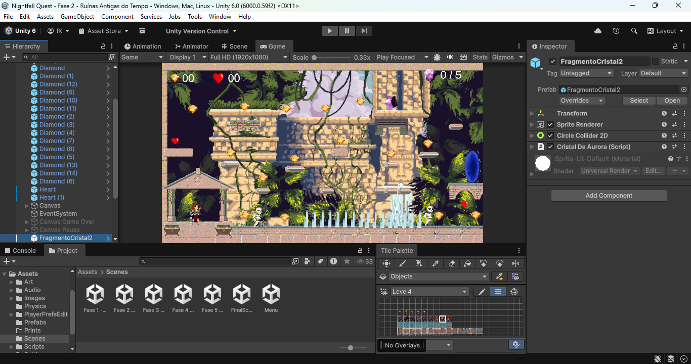
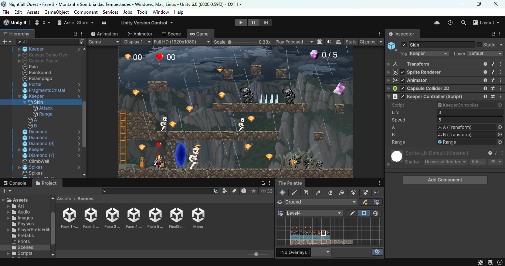
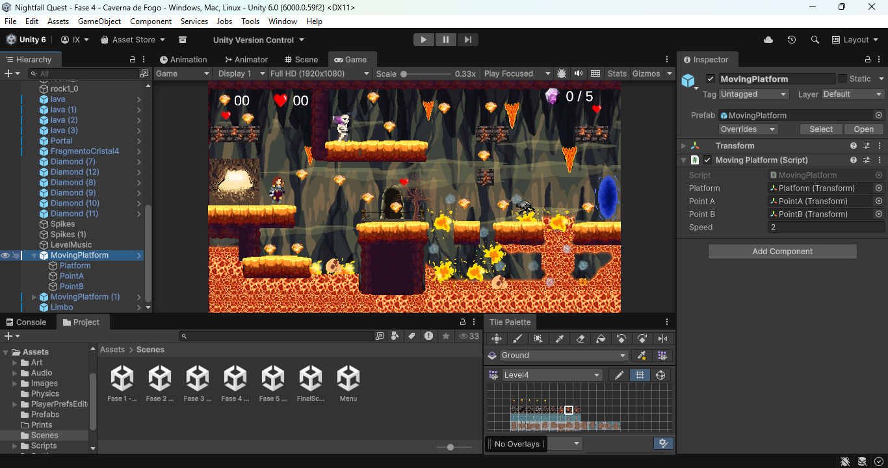
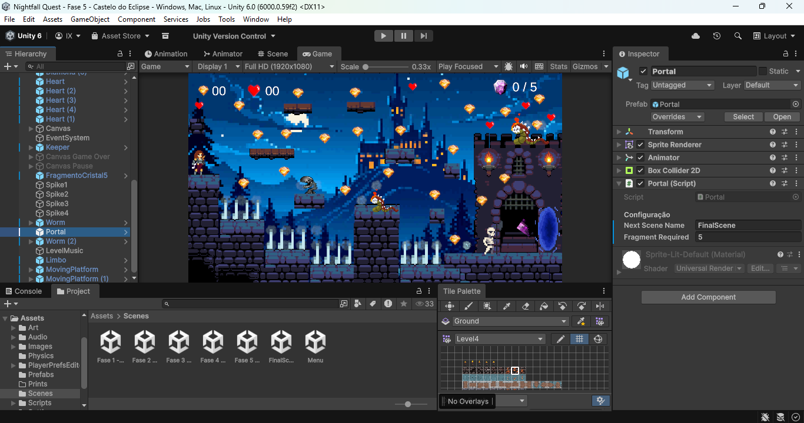
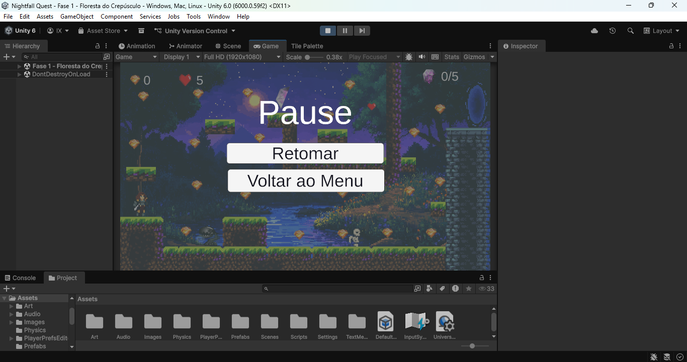

# 🎮 Nightfall Quest

## Projeto Acadêmico – Jogo de Plataforma 2D em Unity

Projeto desenvolvido como atividade avaliativa da disciplina de Desenvolvimento de Jogos, com o objetivo de aplicar conceitos teóricos e práticos na criação de um jogo de plataforma 2D utilizando a Unity e a linguagem C#.

---

## 📚 Objetivo do Projeto

Desenvolver um jogo de plataforma 2D funcional, aplicando conceitos de:
- Mecânicas de jogos
- Interatividade
- Design de níveis
- Programação em C#
- Uso de assets, sprites, animações e áudio

---

## 🕹️ Descrição do Jogo

O jogo acompanha uma personagem que atravessa diferentes mundos em busca da restauração do **Cristal de Aurora**.  
Cada fase apresenta um ambiente único, inimigos, armadilhas e desafios progressivos.  
Ao coletar o cristal de cada fase, a personagem pode acessar o portal para o próximo mundo.

---

## ⚙️ Mecânicas Implementadas

- Movimento lateral (andar e correr)
- Pulo duplo
- Ataque corpo a corpo
- Coleta de itens (diamantes, vidas e cristais)
- Sistema de vida
- Inimigos com comportamento próprio
- Armadilhas
- Portal de progressão de fase
- Sistema de pause
- Tela de Game Over
- Sistema de áudio (música e efeitos sonoros)

---

## 🎮 Controles

| Ação | Tecla |
|----|----|
| Mover | A / D ou ← → |
| Pular/Escalar | W |
| Atacar | Botão esquerdo do mouse |
| Pausar | P |

---

## 🖼️ Prints do Jogo

### Menu


### Fase 1 - Floresta do Crepúsculo


### Fase 2 - Ruínas Antigas do Tempo


### Fase 3 - Montanha Sombria das Tempestades


### Fase 4 - Caverna de Fogo


### Fase 5 - Castelo do Eclipse


### Cena Final


### Tela de Pause


### Tela de Game Over


---

## 🛠️ Tecnologias Utilizadas

- Unity 2D
- Linguagem C#
- Assets gráficos e sonoros gratuitos
- Visual Studio Code

---

## ▶️ Instruções de Execução

1. Clone o repositório:
```bash
git clone https://github.com/Ingridxisto/NightfallQuest
````

2. Abra o projeto na Unity Hub
3. Execute a cena inicial, o Menu

---

## Autora
Ingrid Xisto
Curso: Análise e Desenvolvimento de Sistemas - UNIFECAF
